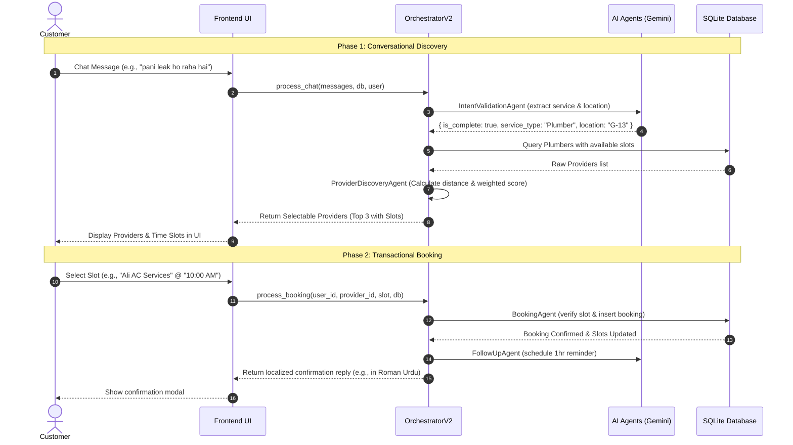

# Karigar AI: Orchestrator V2 Agent Flow & Architecture

This document details the overall architecture, design patterns, and flow of the updated multi-agent orchestrator implemented in `agents_v2.py`.

---

## Architectural Overview

`OrchestratorV2` implements a **hybrid, two-phase pipeline** that separates the conversational AI intent gathering from the transactional slot booking. This architecture allows the LLM (Gemini 2.5 Flash) to manage the chat naturally while letting the frontend UI handle high-integrity slot-selection workflows.

---

## The Two-Phase Pipeline Flow

### Phase 1: Conversational Discovery (`process_chat`)
Triggered when the user sends a chat message. The goal is to extract the service type and location conversational requirements without asking unnecessary questions if coordinates are already known.

1.  **Input**: Chat history `messages`, DB session, and the active `User` record.
2.  **Intent Validation (`IntentValidationAgent`)**:
    *   Injects the user's saved location into the prompt.
    *   Fires a call to **Gemini 2.5 Flash** with rigid JSON instructions.
    *   **Validation check**: Filters out off-topic requests (e.g., jokes, general knowledge, prompt injection) by setting `is_valid: false`.
    *   **Language check**: Detects the language (English, Urdu, or Roman Urdu) to respond dynamically in the same language.
    *   **Extraction**: Maps casual words to concrete services (e.g. *"pani leak"* -> *"Plumber"*).
    *   If information is missing, it short-circuits and prompts the user in their language.
3.  **Discovery (`ProviderDiscoveryAgent`)**:
    *   Triggered once `is_complete` is `true` (service type and location are known).
    *   Queries `Provider` table for all matches on `service_type` that have available slots.
    *   Computes precision distance using the **Haversine formula** between user coordinates and provider coordinates.
    *   Ranks matches using a **Weighted scoring matrix** (explained below).
4.  **Output**: Returns the top 3 closest, highest-rated providers alongside their available slots to the frontend for render.

---

## Phase 2: Transactional Booking (`process_booking`)
Triggered when the user clicks a specific slot card in the UI. This phase is purely transactional, avoiding LLM latency and halluncinations for database operations.

1.  **Verification (`BookingAgent`)**:
    *   Retrieves the selected `Provider` from the DB.
    *   Validates that the selected `slot` is still in the provider's `available_slots` list.
2.  **Execution**:
    *   Removes the selected slot from the provider's `available_slots` JSON field to prevent double bookings.
    *   Inserts a new `Booking` row with `status="Confirmed"` linked directly to the `user_id`.
3.  **Follow-up Scheduling (`FollowUpAgent`)**:
    *   Schedules an automated push reminder 1 hour before the booked time.
4.  **Response**:
    *   Returns a dynamically selected confirmation message matching the user's detected language (`roman_urdu`, `urdu`, or `english`).

---

## Weighted Scoring Algorithm

The `ProviderDiscoveryAgent` employs an advanced rating-distance calculation to ensure the absolute best, closest match is ranked first.

$$\text{Score} = (\text{Normalized Rating} \times 0.4) + (\text{Inverted Proximity} \times 0.6)$$

*   **Proximity (60% weight)**: Proximity score is normalized against the maximum distance in the pool, ensuring close providers get heavily scored.
*   **Rating (40% weight)**: Provider ratings (out of 5.0) are normalized to a 0-1 scale.
*   **Fallback**: If no coordinates are available for calculations, providers are ranked strictly by rating descending.

---

## Agent Components

### 1. `IntentValidationAgent`
*   **Purpose**: Gathers state (`service_type`, `location`) and screens input.
*   **Logic**: One-shot structured JSON parsing.
*   **Language-Aware**: Uses identical system instructions to keep interactions natural and strictly aligned to the user's language.

### 2. `ProviderDiscoveryAgent`
*   **Purpose**: Location-resolved query & scoring.
*   **Coordinates fallback**: Looks up an `AREA_COORDINATES` dictionary mapping sectors (G-13, F-8, I-8, etc.) to geographic coordinates if coordinates are missing from the `User` profile.

### 3. `BookingAgent`
*   **Purpose**: Safe time-slot transactions in SQLite.
*   **Data Integrity**: Writes changes directly using SQL transactions, eliminating race conditions for simultaneously clicked slots.

### 4. `FollowUpAgent`
*   **Purpose**: Post-booking automated customer care simulation.
