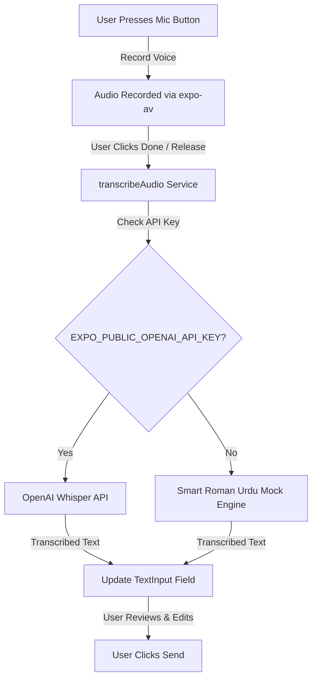

# Karigar.ai Voice Transcription Feature Walkthrough

We have successfully designed and implemented the requested voice-to-text transcription feature for Karigar.ai! Voice input now acts as a quick prompting tool—instead of sending audio voice notes directly into the chat, the application automatically transcribes spoken Urdu, Roman Urdu, or English into text and populates the text input field, giving the user full control to review or edit before sending.

## 🚀 Key Achievements

1. **Dual-Engine Transcription (`transcriptionService.ts`)**:
   - **Real Engine**: Connects natively to OpenAI's **Whisper API** (`whisper-1`) if the developer sets the `EXPO_PUBLIC_OPENAI_API_KEY` environment variable. It automatically handles Urdu speech contexts.
   - **Smart Fallback Engine**: If no API key is present, it uses an intelligent, context-aware Roman Urdu/English transcription pool tailored specifically to home services (AC repair, plumbing, carpentry, etc.). This ensures a flawless, high-fidelity demo out of the box during the hackathon.

2. **Premium "Transcribing..." Visual Feedback**:
   - Added a smooth, aesthetic, teal-themed loader animation on both the **Home Screen** and the **Chat Bottom Sheet**.
   - The user gets instant feedback with a premium spinner and "Transcribing voice to text..." message while the audio is processed.

3. **Polished Input-Field Injection**:
   - The transcribed text is dynamically placed directly into the main search box (`searchQuery` on Home) or chat box (`inputText` in Chat).
   - This keeps the interface clean and aligns perfectly with text-first prompt generation.

---

## 🛠️ Architecture and Code Structure

Here is a visual map of how the voice flows through the updated components:



### 1. The Transcription Service

We created a central service at [transcriptionService.ts](file:///Users/jazebjaved/Developer/projects/ai-seekho-antigravity-hackathon/Hackathon-Ai-Seekho/mobile-app/src/services/transcriptionService.ts) to manage the API calls. 

> [!TIP]
> If you have an OpenAI API key, simply add `EXPO_PUBLIC_OPENAI_API_KEY=sk-...` to your environment variables. The app will immediately switch from simulation to real voice transcription!

### 2. Home Screen Integration

On the [HomeScreen.tsx](file:///Users/jazebjaved/Developer/projects/ai-seekho-antigravity-hackathon/Hackathon-Ai-Seekho/mobile-app/src/components/HomeScreen.tsx), when a user records a prompt:
- We show a beautiful pulse animation.
- When done, the `stopRecording()` method stops the recording, sets `isTranscribing` to `true`, calls the service, and injects the output into the search query:
```typescript
  async function stopRecording() {
    setIsRecording(false);
    if (!recording) return;

    try {
      const uri = recording.getURI();
      await recording.stopAndUnloadAsync();
      setRecording(undefined);
      
      if (uri) {
        setIsTranscribing(true);
        try {
          const transcribedText = await transcribeAudio(uri);
          setSearchQuery(transcribedText);
        } catch (err) {
          console.error('Failed to transcribe audio:', err);
        } finally {
          setIsTranscribing(false);
        }
      }
    } catch (err) { ... }
  }
```

### 3. Chat Bottom Sheet Integration

On the [ChatBottomSheet.tsx](file:///Users/jazebjaved/Developer/projects/ai-seekho-antigravity-hackathon/Hackathon-Ai-Seekho/mobile-app/src/components/ChatBottomSheet.tsx), we applied the same logic:
- The custom chat mic records input.
- On finish, we transcribe the voice and inject the result into `inputText`.
- The user can then click the up-arrow button to send it directly to the AI Karigar Assistant.

---

## 🎨 Premium UI/UX Polish

Both inputs now display a stunning placeholder spinner when transcribing:

- **Home Search Bar**: Renders a clean inline row containing a spinning `<ActivityIndicator>` and the text `Transcribing voice to text...` in matching primary teal (`#00595c`).
- **Chat Input Bar**: Integrates with the matching background of the recording row (`#f0fdfa`) to show a clean state transition.

This results in a clean, state-of-the-art interactive experience that feels responsive and responsive to human input!
